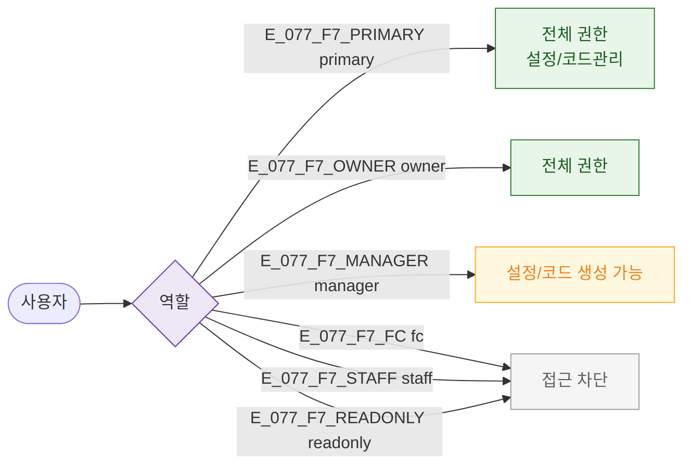

## 3. 다이어그램

## 5. TC 후보

| TC ID | 타입 | Given | When | Then |
|-------|------|-------|------|------|
| TC-077-F7-01 | positive P0 | manager | /referral | 설정/코드 생성 가능 |
| TC-077-F7-02 | negative P0 | fc | 진입 | 접근 차단 |
