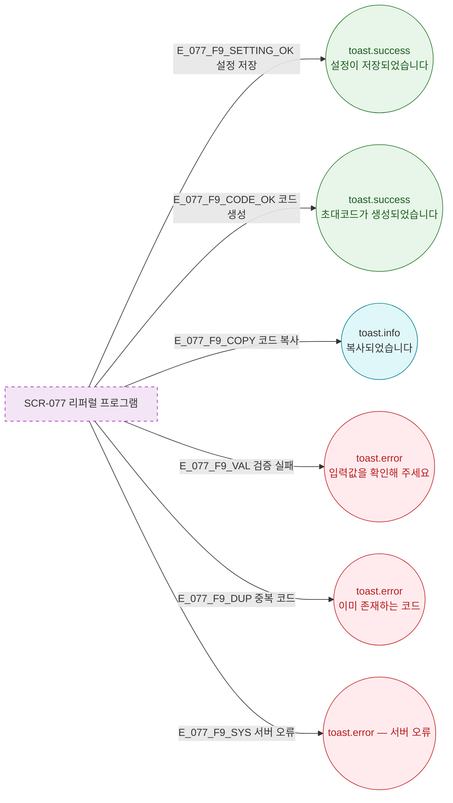

## 3. 다이어그램

## 5. TC 후보

| TC ID | 타입 | Given | When | Then |
|-------|------|-------|------|------|
| TC-077-001 | positive P0 | 설정 저장 | 성공 | toast.success("설정이 저장되었습니다") |
| TC-077-002 | positive P0 | 코드 생성 | 성공 | toast.success("초대코드가 생성되었습니다") |
| TC-077-003 | positive P1 | 코드 복사 | 클릭 | toast.info("복사되었습니다") |
