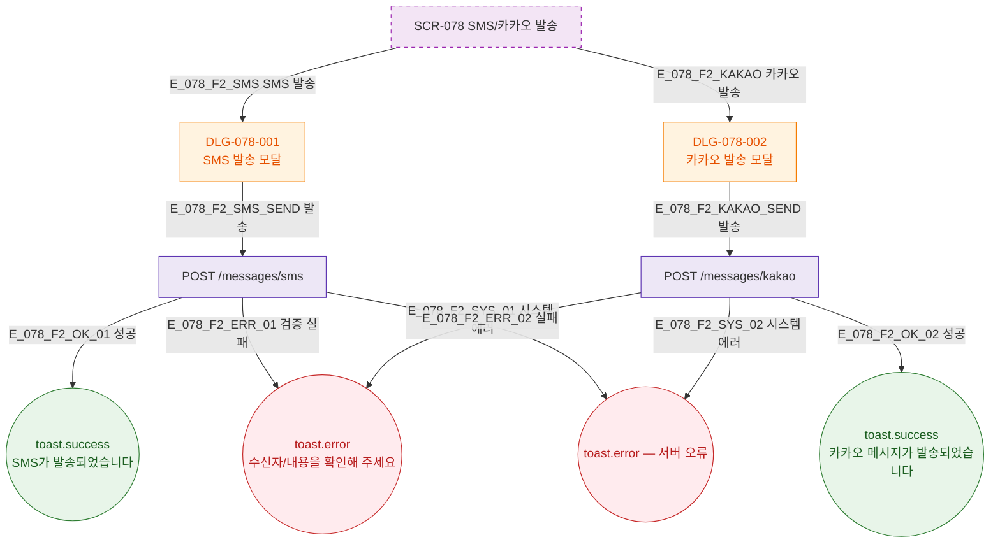

## 1. 목적

SMS/카카오 메시지 발송 Happy Path를 TC 원천으로 제공한다.

## 2. 전제조건

- SCR-078 렌더링 완료

## 3. 다이어그램

## 5. TC 후보

| TC ID | 타입 | Given | When | Then |
|-------|------|-------|------|------|
| TC-078-001 | positive P0 | DLG-078-001 | SMS 발송 | toast.success SMS 발송 완료 |
| TC-078-002 | positive P0 | DLG-078-002 | 카카오 발송 | toast.success 카카오 발송 완료 |
| TC-078-003 | negative P1 | DLG-078-001 | 수신자 없이 발송 | toast.error 수신자 확인 |
