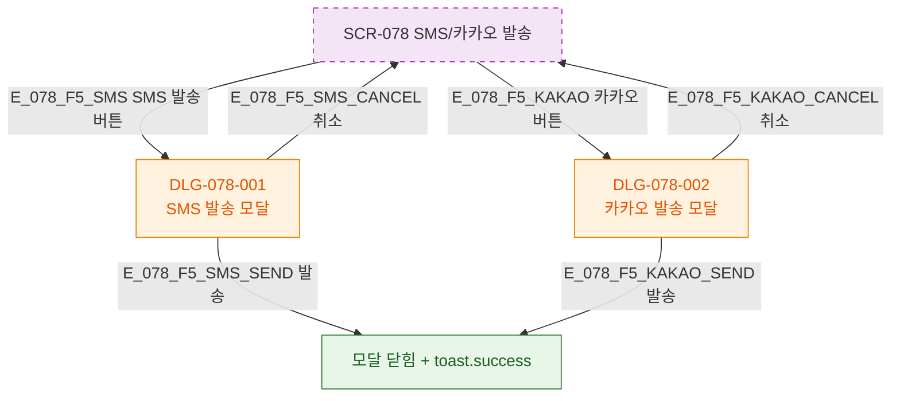

## 3. 다이어그램

## 5. TC 후보

| TC ID | 타입 | Given | When | Then |
|-------|------|-------|------|------|
| TC-078-001 | positive P0 | SMS 발송 버튼 | 클릭 | DLG-078-001 열림 |
| TC-078-002 | positive P0 | 카카오 발송 버튼 | 클릭 | DLG-078-002 열림 |
