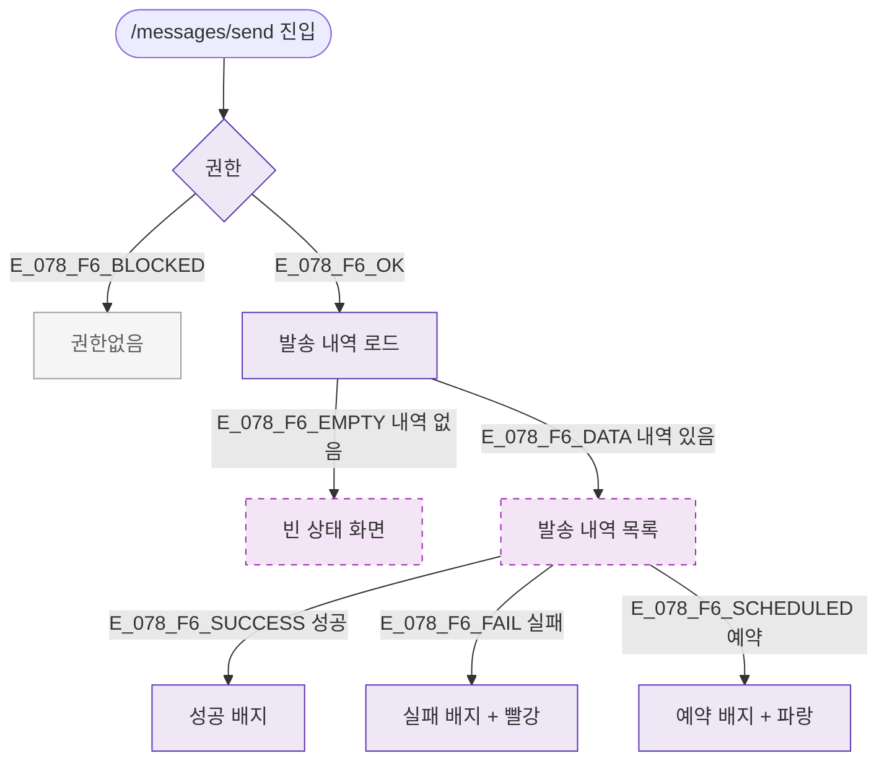

## 3. 다이어그램

```mermaid
flowchart TD
  ENTER([/messages/send 진입]) --> AUTH{권한}
  AUTH -->|E_078_F6_BLOCKED| BLOCKED[권한없음]
  AUTH -->|E_078_F6_OK| LOAD[발송 내역 로드]

  LOAD -->|E_078_F6_EMPTY 내역 없음| EMPTY[빈 상태 화면]
  LOAD -->|E_078_F6_DATA 내역 있음| LIST[발송 내역 목록]

  LIST -->|E_078_F6_SUCCESS 성공| STYLE_OK[성공 배지]
  LIST -->|E_078_F6_FAIL 실패| STYLE_FAIL[실패 배지 + 빨강]
  LIST -->|E_078_F6_SCHEDULED 예약| STYLE_SCHED[예약 배지 + 파랑]

  classDef newFeature  fill:#F3E5F5,stroke:#9C27B0,stroke-dasharray:5 5
  classDef rbacBlocked fill:#F5F5F5,stroke:#9E9E9E,color:#616161
  classDef system      fill:#EDE7F6,stroke:#5E35B2

  class LIST,EMPTY newFeature
  class BLOCKED rbacBlocked
  class STYLE_OK,STYLE_FAIL,STYLE_SCHED,AUTH,LOAD system
```

## 5. TC 후보

| TC ID | 타입 | Given | When | Then |
|-------|------|-------|------|------|
| TC-078-F6-01 | positive P1 | 발송 실패 내역 | 목록 | 실패 배지 표시 |
