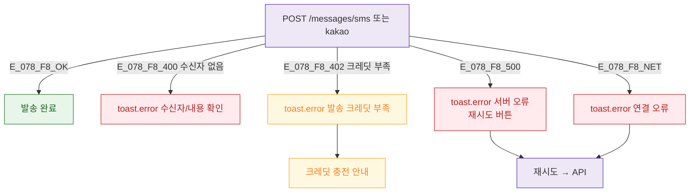

## 3. 다이어그램

## 5. TC 후보

| TC ID | 타입 | Given | When | Then |
|-------|------|-------|------|------|
| TC-078-003 | negative P1 | SMS 발송 | 수신자 없음 | toast.error 수신자 확인 |
| TC-078-F8-01 | negative P1 | 발송 | 크레딧 부족 402 | toast.error + 충전 안내 |
