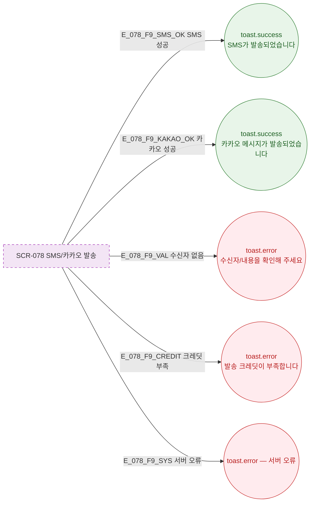

## 3. 다이어그램

## 5. TC 후보

| TC ID | 타입 | Given | When | Then |
|-------|------|-------|------|------|
| TC-078-001 | positive P0 | SMS 발송 | 성공 | toast.success("SMS가 발송되었습니다") |
| TC-078-002 | positive P0 | 카카오 발송 | 성공 | toast.success("카카오 메시지가 발송되었습니다") |
| TC-078-003 | negative P1 | 발송 | 수신자 없음 | toast.error("수신자/내용을 확인해 주세요") |
