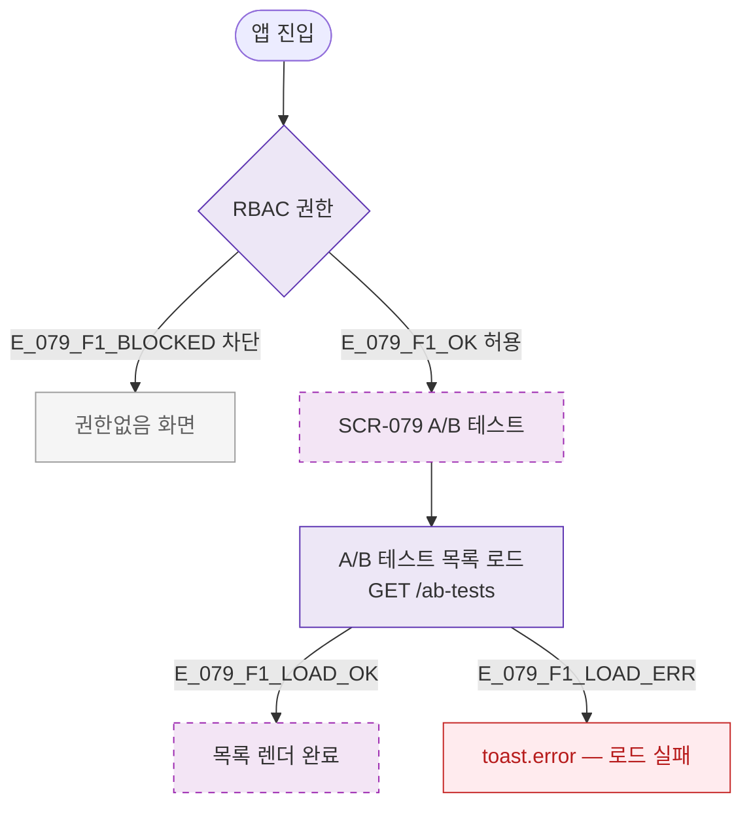

## 3. 다이어그램

## 5. TC 후보

| TC ID | 타입 | Given | When | Then |
|-------|------|-------|------|------|
| TC-079-F1-01 | positive P0 | manager | /ab-tests 진입 | A/B 테스트 목록 렌더 완료 |
| TC-079-F1-02 | negative P0 | fc | 진입 시도 | 권한없음 화면 |
