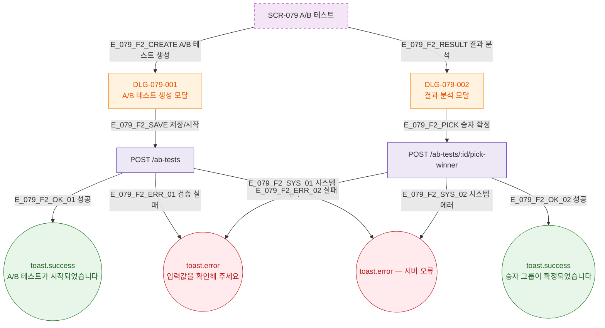

## 1. 목적

A/B 테스트 생성/실행/결과분석 Happy Path를 TC 원천으로 제공한다.

## 2. 전제조건

- SCR-079 렌더링 완료

## 3. 다이어그램

## 5. TC 후보

| TC ID | 타입 | Given | When | Then |
|-------|------|-------|------|------|
| TC-079-001 | positive P0 | DLG-079-001 | 저장/시작 | toast.success A/B 테스트 시작 |
| TC-079-002 | positive P1 | DLG-079-002 | 승자 확정 | toast.success 승자 그룹 확정 |
| TC-079-003 | negative P1 | DLG-079-001 | 그룹 미설정 | toast.error 입력값 확인 |
