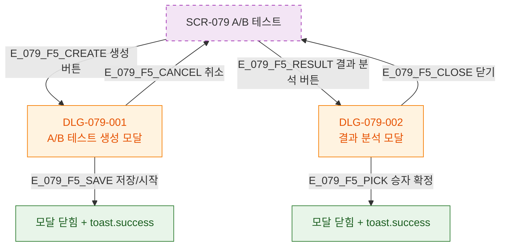

## 3. 다이어그램

## 5. TC 후보

| TC ID | 타입 | Given | When | Then |
|-------|------|-------|------|------|
| TC-079-001 | positive P0 | 생성 버튼 | 클릭 | DLG-079-001 열림 |
| TC-079-002 | positive P1 | 결과 분석 버튼 | 클릭 | DLG-079-002 열림 |
