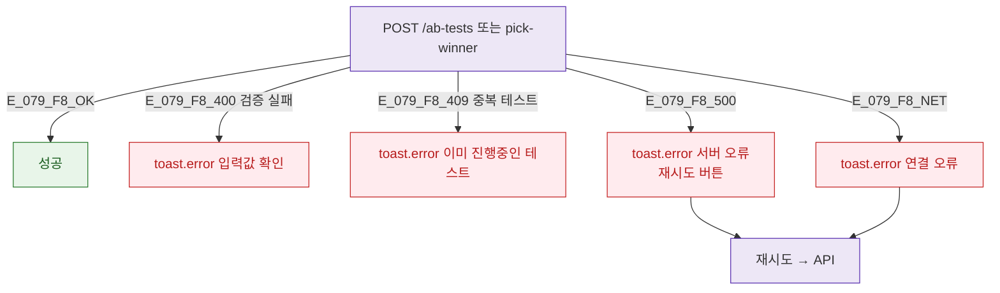

## 3. 다이어그램

## 5. TC 후보

| TC ID | 타입 | Given | When | Then |
|-------|------|-------|------|------|
| TC-079-003 | negative P1 | 생성 | 그룹 미설정 | toast.error 입력값 확인 |
| TC-079-F8-01 | negative P1 | 생성 | 동일 대상 중복 409 | toast.error 진행중 테스트 존재 |
