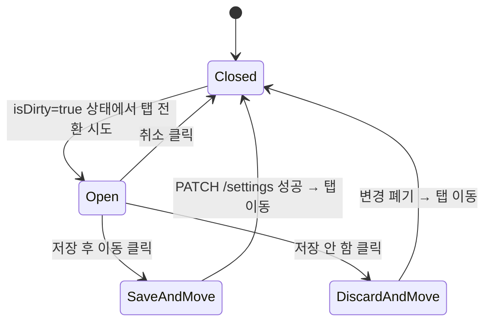

## 다이어그램

## 모달 속성
| 항목 | 값 |
|------|-----|
| variant | warning |
| title | 저장되지 않은 변경사항 |
| description | 변경사항이 저장되지 않았습니다. 저장 후 이동하시겠습니까? |
| confirmLabel | 저장 후 이동 |
| cancelLabel | 저장 안 함 |
| closeLabel | 취소 |
