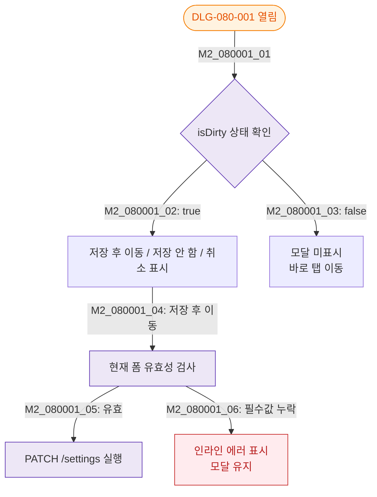

## 다이어그램

```mermaid
flowchart TD
    Open([DLG-080-001 열림]) -->|M2_080001_01| CheckDirty{isDirty 상태 확인}
    CheckDirty -->|M2_080001_02: true| ShowButtons[저장 후 이동 / 저장 안 함 / 취소 표시]
    CheckDirty -->|M2_080001_03: false| AutoClose[모달 미표시\n바로 탭 이동]

    ShowButtons -->|M2_080001_04: 저장 후 이동| ValidateSave[현재 폼 유효성 검사]
    ValidateSave -->|M2_080001_05: 유효| ProceedSave[PATCH /settings 실행]
    ValidateSave -->|M2_080001_06: 필수값 누락| E_Invalid[인라인 에러 표시\n모달 유지]

    classDef modal fill:#FFF3E0,stroke:#F57C00,color:#E65100
    classDef system fill:#EDE7F6,stroke:#5E35B2
    classDef error fill:#FFEBEE,stroke:#C62828,color:#B71C1C
    class Open modal
    class CheckDirty,ValidateSave,ProceedSave system
    class E_Invalid error
```
