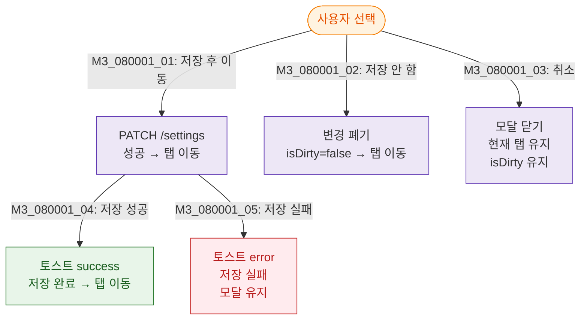

## 다이어그램

```mermaid
flowchart TD
    Action([사용자 선택]) -->|M3_080001_01: 저장 후 이동| SavePath[PATCH /settings\n성공 → 탭 이동]
    Action -->|M3_080001_02: 저장 안 함| DiscardPath[변경 폐기\nisDirty=false → 탭 이동]
    Action -->|M3_080001_03: 취소| CancelPath[모달 닫기\n현재 탭 유지\nisDirty 유지]

    SavePath -->|M3_080001_04: 저장 성공| T_SaveOK[토스트 success\n저장 완료 → 탭 이동]
    SavePath -->|M3_080001_05: 저장 실패| T_SaveFail[토스트 error\n저장 실패\n모달 유지]

    classDef modal fill:#FFF3E0,stroke:#F57C00,color:#E65100
    classDef success fill:#E8F5E9,stroke:#2E7D32,color:#1B5E20
    classDef error fill:#FFEBEE,stroke:#C62828,color:#B71C1C
    classDef system fill:#EDE7F6,stroke:#5E35B2
    class Action modal
    class T_SaveOK success
    class T_SaveFail error
    class SavePath,DiscardPath,CancelPath system
```
