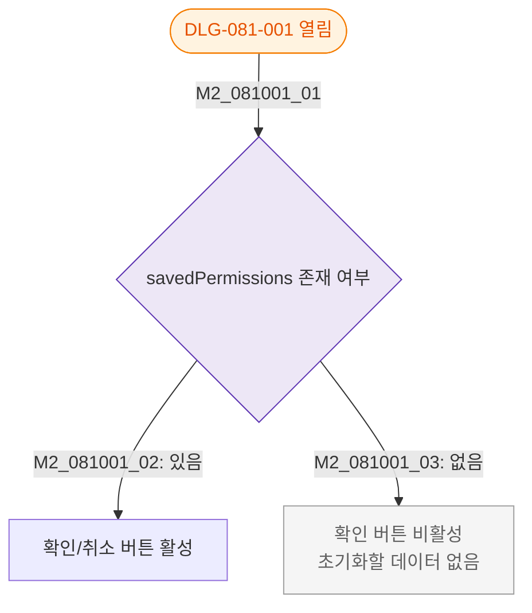

## 다이어그램

```mermaid
flowchart TD
    Open([DLG-081-001 열림]) -->|M2_081001_01| CheckSaved{savedPermissions 존재 여부}
    CheckSaved -->|M2_081001_02: 있음| ShowConfirm[확인/취소 버튼 활성]
    CheckSaved -->|M2_081001_03: 없음| DisableConfirm[확인 버튼 비활성\n초기화할 데이터 없음]

    classDef modal fill:#FFF3E0,stroke:#F57C00,color:#E65100
    classDef system fill:#EDE7F6,stroke:#5E35B2
    classDef rbacBlocked fill:#F5F5F5,stroke:#9E9E9E,color:#616161
    class Open modal
    class CheckSaved system
    class DisableConfirm rbacBlocked
```
