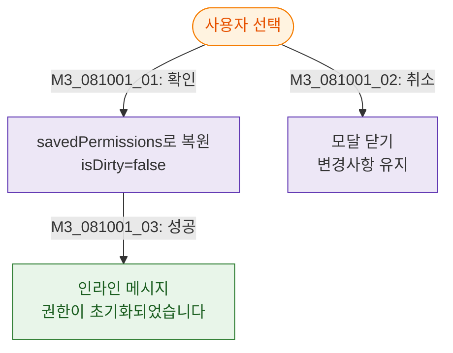

## 다이어그램

```mermaid
flowchart TD
    Action([사용자 선택]) -->|M3_081001_01: 확인| ResetPath[savedPermissions로 복원\nisDirty=false]
    Action -->|M3_081001_02: 취소| CancelPath[모달 닫기\n변경사항 유지]

    ResetPath -->|M3_081001_03: 성공| T_ResetOK[인라인 메시지\n권한이 초기화되었습니다]

    classDef modal fill:#FFF3E0,stroke:#F57C00,color:#E65100
    classDef success fill:#E8F5E9,stroke:#2E7D32,color:#1B5E20
    classDef system fill:#EDE7F6,stroke:#5E35B2
    class Action modal
    class T_ResetOK success
    class ResetPath,CancelPath system
```
