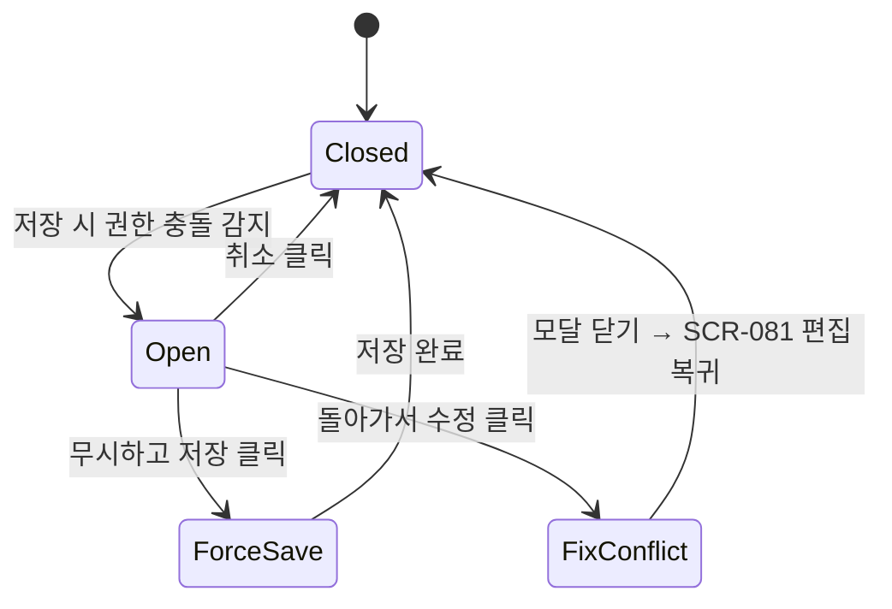

## 다이어그램

```mermaid
stateDiagram-v2
    [*] --> Closed
    Closed --> Open: 저장 시 권한 충돌 감지
    Open --> ForceSave: 무시하고 저장 클릭
    Open --> FixConflict: 돌아가서 수정 클릭
    Open --> Closed: 취소 클릭
    ForceSave --> Closed: 저장 완료
    FixConflict --> Closed: 모달 닫기 → SCR-081 편집 복귀
```

## 모달 속성
| 항목 | 값 | |------|-----| | variant | warning | | title | 권한 충돌 감지 | | description | 삭제 권한이 활성화되었으나 수정 권한이 비활성화되어 있습니다. 이 설정은 논리적으로 충돌합니다. | | | 무시하고 저장 | | | 돌아가서 수정 |
