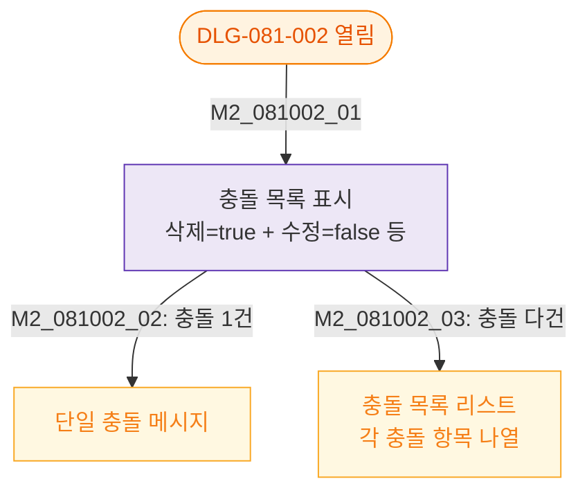

## 다이어그램

```mermaid
flowchart TD
    Open([DLG-081-002 열림]) -->|M2_081002_01| ConflictList[충돌 목록 표시\n삭제=true + 수정=false 등]
    ConflictList -->|M2_081002_02: 충돌 1건| SingleConflict[단일 충돌 메시지]
    ConflictList -->|M2_081002_03: 충돌 다건| MultiConflict[충돌 목록 리스트\n각 충돌 항목 나열]

    classDef modal fill:#FFF3E0,stroke:#F57C00,color:#E65100
    classDef warning fill:#FFF8E1,stroke:#F9A825,color:#F57F17
    classDef system fill:#EDE7F6,stroke:#5E35B2
    class Open modal
    class SingleConflict,MultiConflict warning
    class ConflictList system
```
