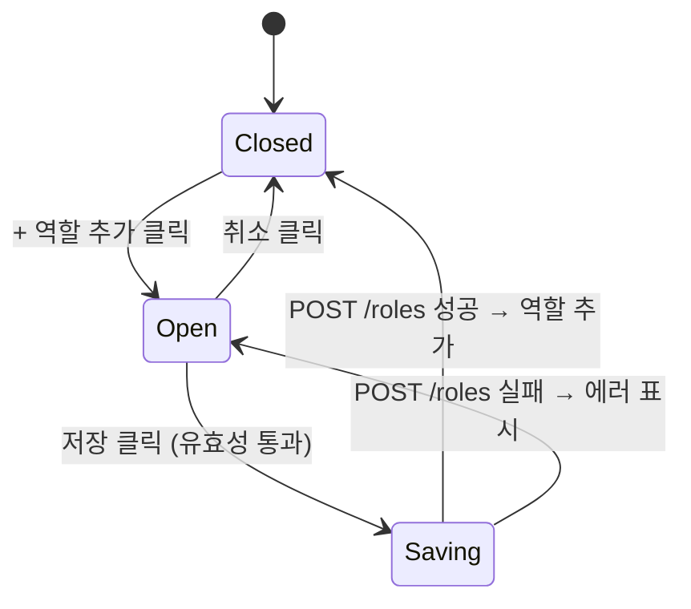

## 다이어그램

```mermaid
stateDiagram-v2
    [*] --> Closed
    Closed --> Open: + 역할 추가 클릭
    Open --> Saving: 저장 클릭 (유효성 통과)
    Open --> Closed: 취소 클릭
    Saving --> Closed: POST /roles 성공 → 역할 추가
    Saving --> Open: POST /roles 실패 → 에러 표시
```

## 모달 속성
| 항목 | 값 | |------|-----| | variant | primary | | title | 새 역할 추가 | | | 저장 | | | 취소 | | fields | 역할 이름(필수), 역할 코드(필수), 설명, 기준 역할 |
