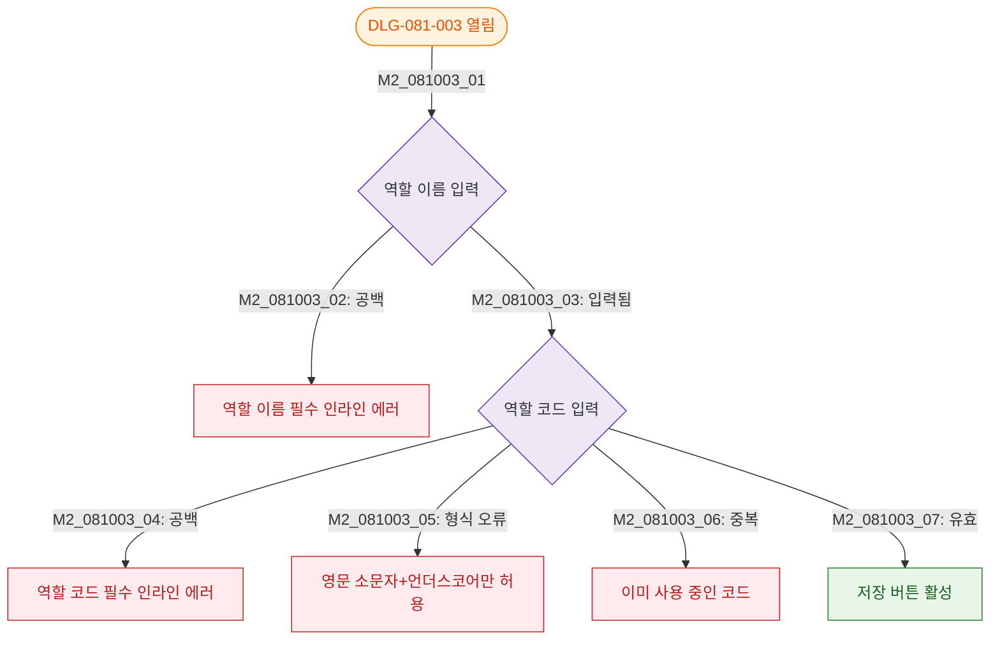

## 다이어그램

```mermaid
flowchart TD
    Open([DLG-081-003 열림]) -->|M2_081003_01| NameCheck{역할 이름 입력}
    NameCheck -->|M2_081003_02: 공백| E_Name[역할 이름 필수 인라인 에러]
    NameCheck -->|M2_081003_03: 입력됨| CodeCheck{역할 코드 입력}

    CodeCheck -->|M2_081003_04: 공백| E_Code[역할 코드 필수 인라인 에러]
    CodeCheck -->|M2_081003_05: 형식 오류| E_CodeFormat[영문 소문자+언더스코어만 허용]
    CodeCheck -->|M2_081003_06: 중복| E_CodeDup[이미 사용 중인 코드]
    CodeCheck -->|M2_081003_07: 유효| AllValid[저장 버튼 활성]

    classDef modal fill:#FFF3E0,stroke:#F57C00,color:#E65100
    classDef error fill:#FFEBEE,stroke:#C62828,color:#B71C1C
    classDef success fill:#E8F5E9,stroke:#2E7D32,color:#1B5E20
    classDef system fill:#EDE7F6,stroke:#5E35B2
    class Open modal
    class E_Name,E_Code,E_CodeFormat,E_CodeDup error
    class AllValid success
    class NameCheck,CodeCheck system
```
