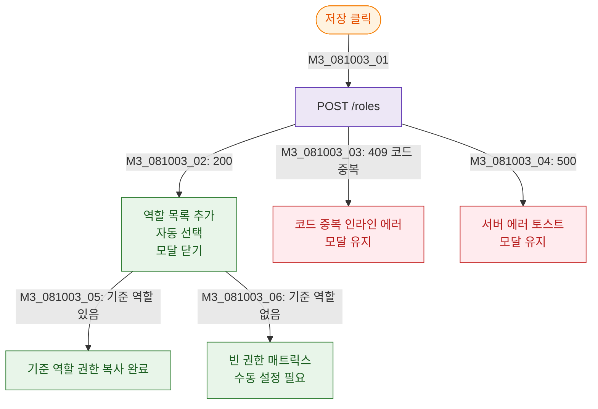

## 다이어그램

```mermaid
flowchart TD
    Action([저장 클릭]) -->|M3_081003_01| ACT_Create[POST /roles]
    ACT_Create -->|"M3_081003_02: 200"| RoleAdded[역할 목록 추가\n자동 선택\n모달 닫기]
    ACT_Create -->|"M3_081003_03: 409 코드 중복"| E_Dup[코드 중복 인라인 에러\n모달 유지]
    ACT_Create -->|"M3_081003_04: 500"| E_Server[서버 에러 토스트\n모달 유지]

    RoleAdded -->|"M3_081003_05: 기준 역할 있음"| CopyPerms[기준 역할 권한 복사 완료]
    RoleAdded -->|"M3_081003_06: 기준 역할 없음"| EmptyPerms[빈 권한 매트릭스\n수동 설정 필요]

    classDef modal fill:#FFF3E0,stroke:#F57C00,color:#E65100
    classDef success fill:#E8F5E9,stroke:#2E7D32,color:#1B5E20
    classDef error fill:#FFEBEE,stroke:#C62828,color:#B71C1C
    classDef system fill:#EDE7F6,stroke:#5E35B2
    class Action modal
    class RoleAdded,CopyPerms,EmptyPerms success
    class E_Dup,E_Server error
    class ACT_Create system
```
