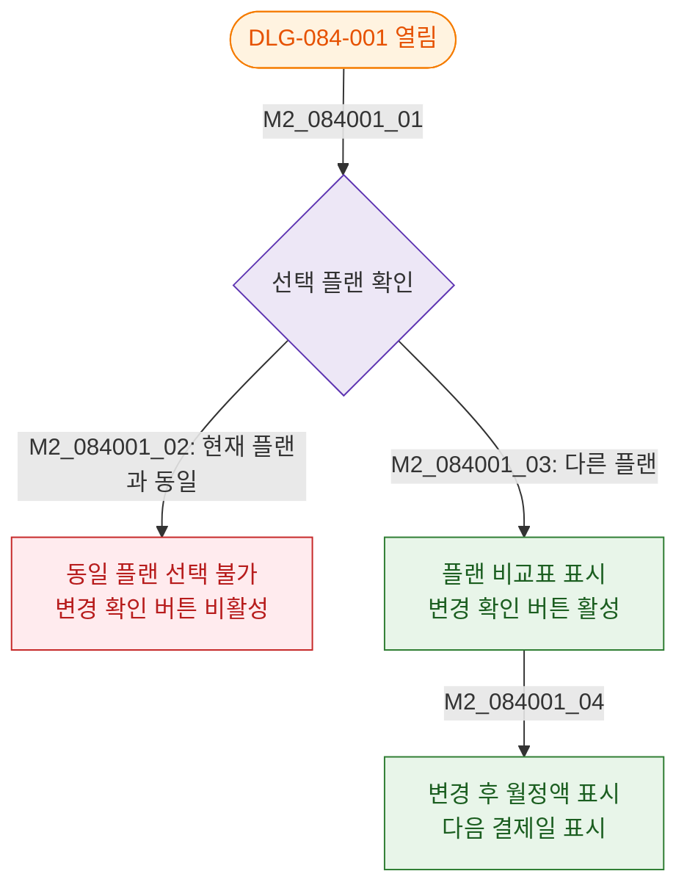

## 다이어그램

```mermaid
flowchart TD
    Open([DLG-084-001 열림]) -->|M2_084001_01| PlanCheck{선택 플랜 확인}
    PlanCheck -->|M2_084001_02: 현재 플랜과 동일| E_SamePlan[동일 플랜 선택 불가\n변경 확인 버튼 비활성]
    PlanCheck -->|M2_084001_03: 다른 플랜| ShowComparison[플랜 비교표 표시\n변경 확인 버튼 활성]

    ShowComparison -->|M2_084001_04| PriceInfo[변경 후 월정액 표시\n다음 결제일 표시]

    classDef modal fill:#FFF3E0,stroke:#F57C00,color:#E65100
    classDef error fill:#FFEBEE,stroke:#C62828,color:#B71C1C
    classDef success fill:#E8F5E9,stroke:#2E7D32,color:#1B5E20
    classDef system fill:#EDE7F6,stroke:#5E35B2
    class Open modal
    class E_SamePlan error
    class ShowComparison,PriceInfo success
    class PlanCheck system
```
