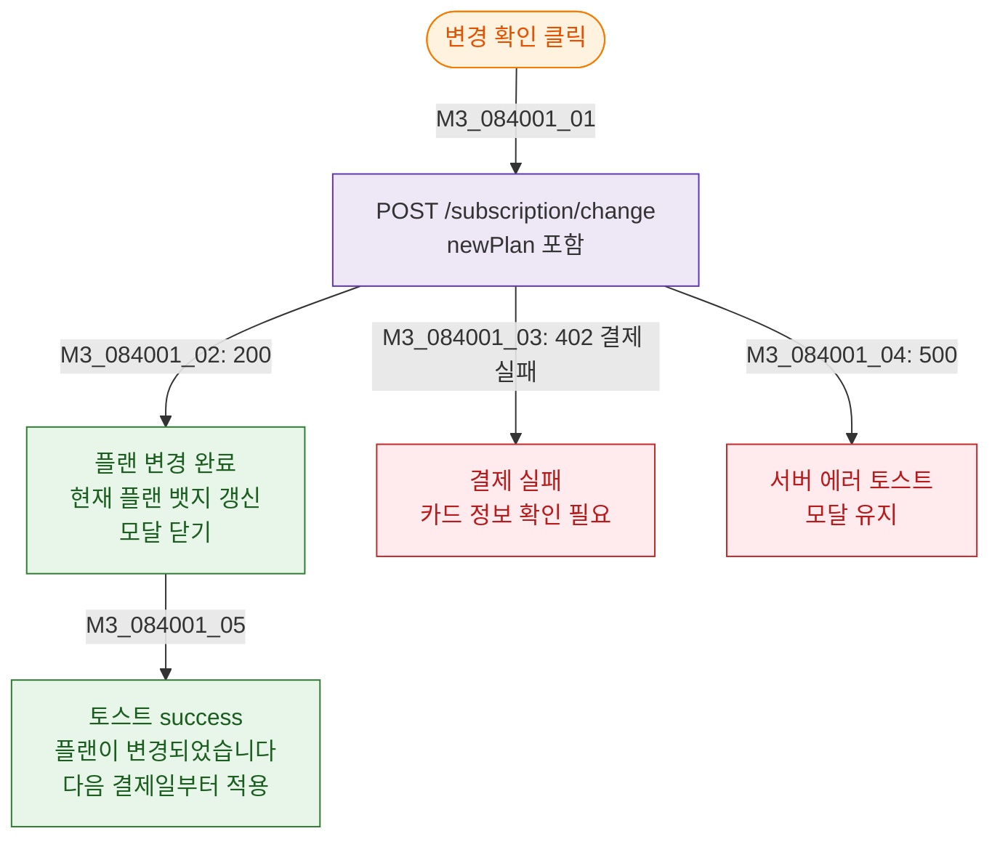

## 다이어그램

```mermaid
flowchart TD
    Action([변경 확인 클릭]) -->|M3_084001_01| ACT_Change[POST /subscription/change\nnewPlan 포함]
    ACT_Change -->|"M3_084001_02: 200"| PlanChanged[플랜 변경 완료\n현재 플랜 뱃지 갱신\n모달 닫기]
    ACT_Change -->|"M3_084001_03: 402 결제 실패"| E_Payment[결제 실패\n카드 정보 확인 필요]
    ACT_Change -->|"M3_084001_04: 500"| E_Server[서버 에러 토스트\n모달 유지]

    PlanChanged -->|M3_084001_05| T_PlanOK[토스트 success\n플랜이 변경되었습니다\n다음 결제일부터 적용]

    classDef modal fill:#FFF3E0,stroke:#F57C00,color:#E65100
    classDef success fill:#E8F5E9,stroke:#2E7D32,color:#1B5E20
    classDef error fill:#FFEBEE,stroke:#C62828,color:#B71C1C
    classDef system fill:#EDE7F6,stroke:#5E35B2
    class Action modal
    class PlanChanged,T_PlanOK success
    class E_Payment,E_Server error
    class ACT_Change system
```
