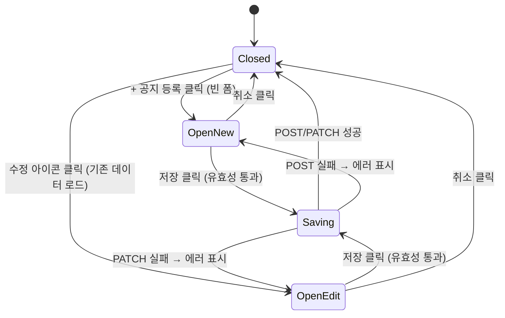

## 다이어그램

```mermaid
stateDiagram-v2
    [*] --> Closed
    Closed --> OpenNew: + 공지 등록 클릭 (빈 폼)
    Closed --> OpenEdit: 수정 아이콘 클릭 (기존 데이터 로드)
    OpenNew --> Saving: 저장 클릭 (유효성 통과)
    OpenEdit --> Saving: 저장 클릭 (유효성 통과)
    OpenNew --> Closed: 취소 클릭
    OpenEdit --> Closed: 취소 클릭
    Saving --> Closed: POST/PATCH 성공
    Saving --> OpenNew: POST 실패 → 에러 표시
    Saving --> OpenEdit: PATCH 실패 → 에러 표시
```

## 모달 속성
| 항목 | 값 | |------|-----| | variant | primary | | title | 공지 등록 / 공지 수정 | | | 저장 | | | 취소 | | fields | 제목(필수), 내용(필수), 고정 여부, 알림 발송, 첨부파일 |
