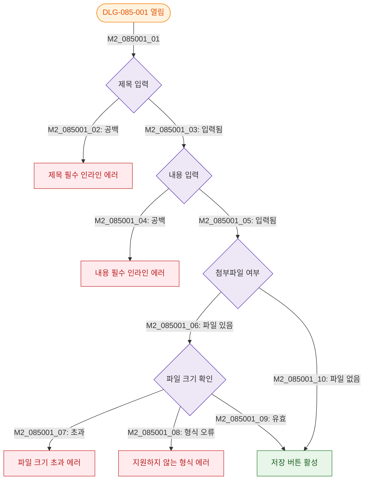

## 다이어그램

```mermaid
flowchart TD
    Open([DLG-085-001 열림]) -->|M2_085001_01| TitleCheck{제목 입력}
    TitleCheck -->|M2_085001_02: 공백| E_Title[제목 필수 인라인 에러]
    TitleCheck -->|M2_085001_03: 입력됨| ContentCheck{내용 입력}

    ContentCheck -->|M2_085001_04: 공백| E_Content[내용 필수 인라인 에러]
    ContentCheck -->|M2_085001_05: 입력됨| FileCheck{첨부파일 여부}

    FileCheck -->|M2_085001_06: 파일 있음| FileSizeCheck{파일 크기 확인}
    FileSizeCheck -->|M2_085001_07: 초과| E_FileSize[파일 크기 초과 에러]
    FileSizeCheck -->|M2_085001_08: 형식 오류| E_FileType[지원하지 않는 형식 에러]
    FileSizeCheck -->|M2_085001_09: 유효| AllValid[저장 버튼 활성]
    FileCheck -->|M2_085001_10: 파일 없음| AllValid

    classDef modal fill:#FFF3E0,stroke:#F57C00,color:#E65100
    classDef error fill:#FFEBEE,stroke:#C62828,color:#B71C1C
    classDef success fill:#E8F5E9,stroke:#2E7D32,color:#1B5E20
    classDef system fill:#EDE7F6,stroke:#5E35B2
    class Open modal
    class E_Title,E_Content,E_FileSize,E_FileType error
    class AllValid success
    class TitleCheck,ContentCheck,FileCheck,FileSizeCheck system
```
