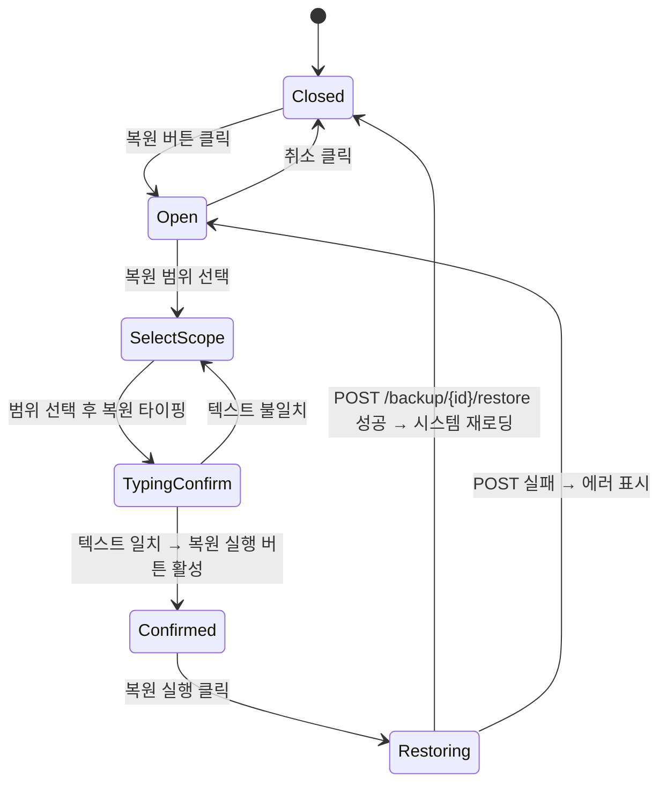

## 다이어그램

## 모달 속성
| 항목 | 값 |
|------|-----|
| variant | danger |
| title | 데이터 복원 |
| description | {backupDate} 백업으로 복원하시겠습니까? 현재 데이터가 덮어씌워집니다. 이 작업은 되돌릴 수 없습니다. |
| confirmLabel | 복원 실행 |
| cancelLabel | 취소 |
| confirmationText | 복원 |
| fields | 복원 범위 Select (전체/선택) |
