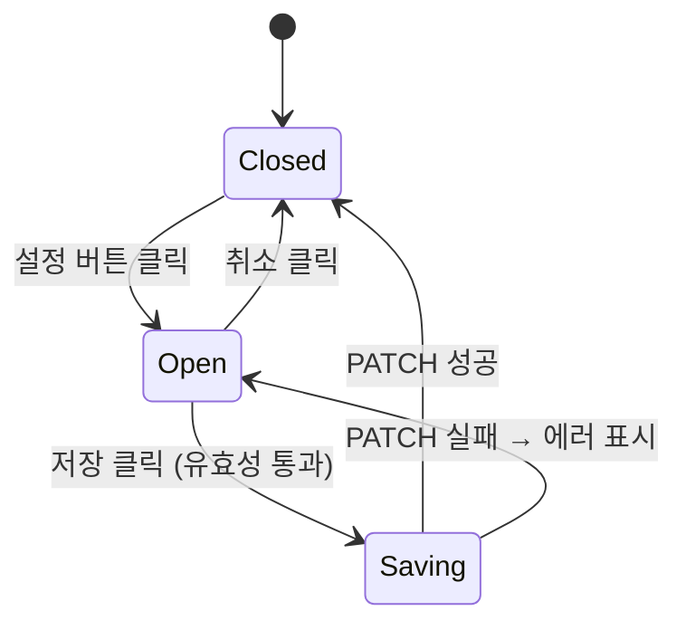

## 다이어그램

## 모달 속성
| 항목 | 값 | |------|-----| | variant | primary | | title | 백업 설정 | | | 저장 | | | 취소 | | fields | 자동 백업 활성(Toggle), 백업 주기(Select), 백업 시간(Input time), 보관 기간(Select), 백업 범위(Checkbox), 알림 수신자(Select) |
