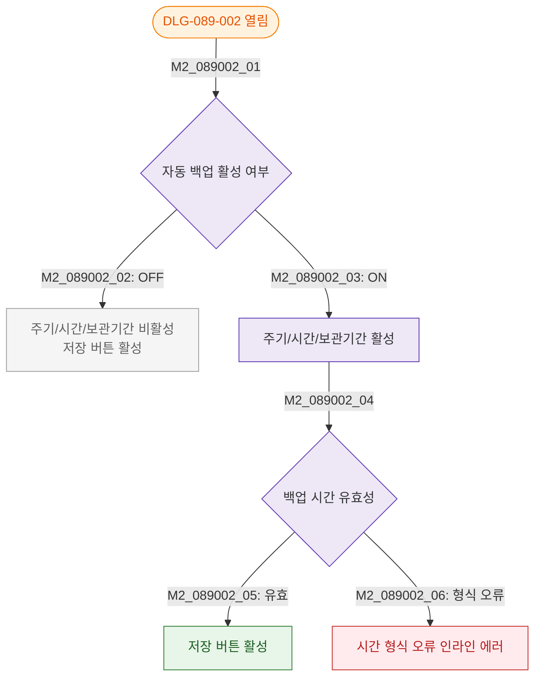

## 다이어그램

```mermaid
flowchart TD
    Open([DLG-089-002 열림]) -->|M2_089002_01| AutoToggle{자동 백업 활성 여부}
    AutoToggle -->|"M2_089002_02: OFF"| DisableFields[주기/시간/보관기간 비활성\n저장 버튼 활성]
    AutoToggle -->|"M2_089002_03: ON"| EnableFields[주기/시간/보관기간 활성]

    EnableFields -->|M2_089002_04| TimeCheck{백업 시간 유효성}
    TimeCheck -->|"M2_089002_05: 유효"| AllValid[저장 버튼 활성]
    TimeCheck -->|"M2_089002_06: 형식 오류"| E_Time[시간 형식 오류 인라인 에러]

    classDef modal fill:#FFF3E0,stroke:#F57C00,color:#E65100
    classDef error fill:#FFEBEE,stroke:#C62828,color:#B71C1C
    classDef success fill:#E8F5E9,stroke:#2E7D32,color:#1B5E20
    classDef system fill:#EDE7F6,stroke:#5E35B2
    classDef rbacBlocked fill:#F5F5F5,stroke:#9E9E9E,color:#616161
    class Open modal
    class E_Time error
    class AllValid success
    class AutoToggle,EnableFields,TimeCheck system
    class DisableFields rbacBlocked
```
