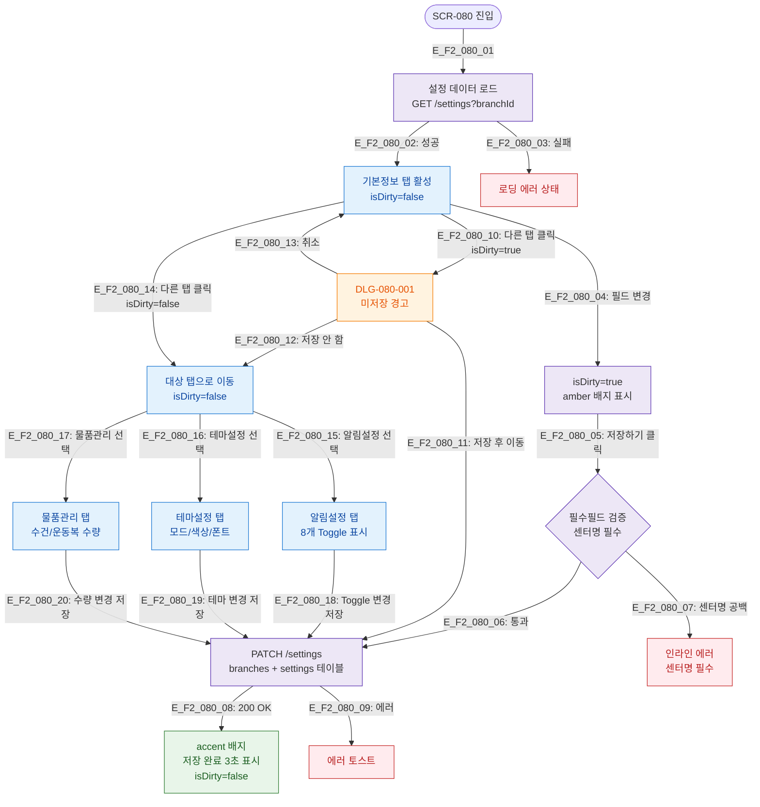

## 목적
센터 설정 4개 탭(기본정보/알림설정/테마설정/물품관리)의 정상 시나리오 Happy Path를 정의한다.

## 전제조건
- primary 또는 owner 로그인
- /settings 진입 완료

## 다이어그램

## 엣지 설명
| 엣지 ID | 설명 |
|---------|------|
| E_F2_080_04 | 필드 변경 시 isDirty=true, amber 배지 표시 |
| E_F2_080_10 | isDirty=true 상태에서 탭 전환 → 미저장 경고 모달 |
| E_F2_080_11 | 미저장 경고 → 저장 후 이동 |
| E_F2_080_12 | 미저장 경고 → 저장 안 함 (변경 폐기) |

## TC 후보
- TC-080-002: 센터명 변경 → 저장 → accent 배지 3초 표시
- TC-080-003: 필드 변경 → amber 배지 "저장되지 않은 변경사항" 표시
- TC-080-004: isDirty=true → 탭 클릭 → DLG-080-001 표시
- TC-080-005: 미저장 경고 → 저장 후 이동 → 저장 성공 → 탭 이동
- TC-080-006: 미저장 경고 → 저장 안 함 → 변경 폐기 → 탭 이동
