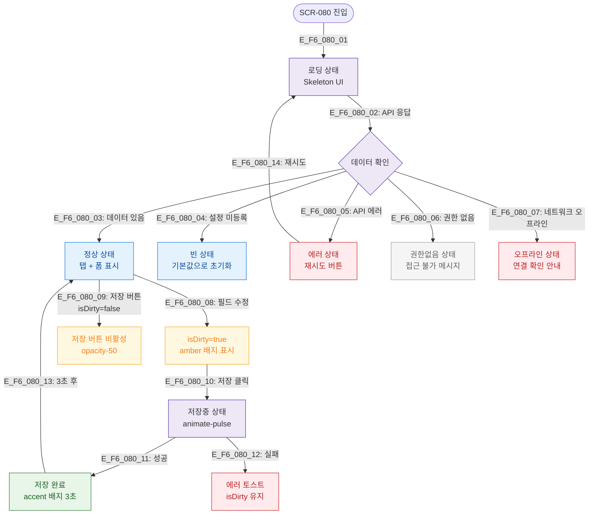

## 목적
SCR-080의 로딩/빈/에러/권한없음/저장중 등 모든 UI 상태 분기를 정의한다.

## 다이어그램

## TC 후보
- TC-080-003: 필드 변경 → amber 배지 "저장되지 않은 변경사항" 표시
- TC-080-014: isDirty=false → 저장 버튼 opacity-50 + cursor-not-allowed
- TC-080-NEG-003: API 에러 → 에러 상태 + 재시도 버튼
- TC-080-NEG-004: 오프라인 → 오프라인 안내
