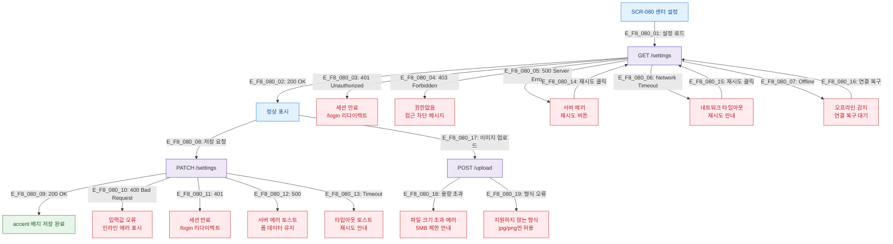

## 목적
SCR-080에서 발생 가능한 모든 에러 및 예외 상황과 복구 경로를 정의한다.

## 다이어그램

## TC 후보
- TC-080-NEG-003: 설정 로드 API 500 → 에러 상태 + 재시도 버튼
- TC-080-NEG-004: 오프라인 → 오프라인 안내 표시
- TC-080-NEG-006: 저장 API 500 → 에러 토스트 + 폼 데이터 유지
- TC-080-NEG-007: 세션 만료 중 저장 시도 → /login 리다이렉트
- TC-080-NEG-008: 이미지 업로드 5MB 초과 → 에러 메시지
