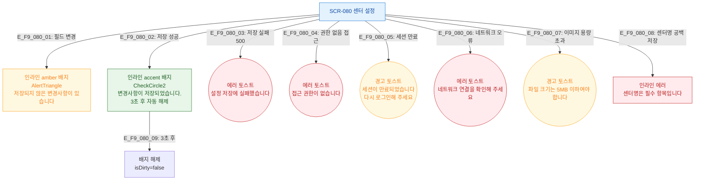

## 목적
SCR-080에서 발생하는 모든 피드백(인라인 배지/토스트/에러) 조건을 정의한다.

## 다이어그램

## TC 후보
- TC-080-002: 저장 성공 → accent 배지 "변경사항이 저장되었습니다." 3초 표시
- TC-080-003: 필드 변경 → amber 배지 "저장되지 않은 변경사항이 있습니다"
- TC-080-NEG-006: API 500 → 에러 토스트
- TC-080-NEG-007: 세션 만료 → 경고 토스트 + 리다이렉트
