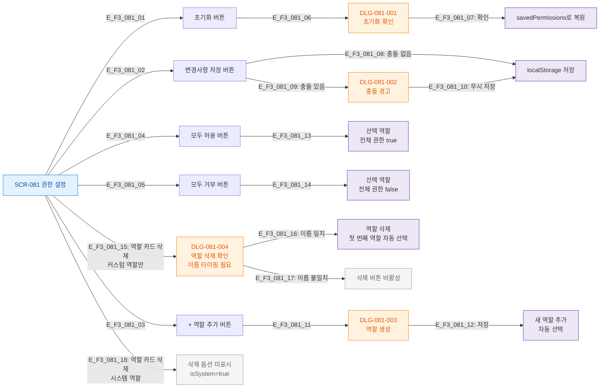

## 목적
SCR-081의 모든 버튼 및 인터랙티브 요소를 노드화하고 동작을 매핑한다.

## 다이어그램

## TC 후보
- TC-081-004: 모두 허용 → 22메뉴 × 5권한 true
- TC-081-005: 모두 거부 → 22메뉴 × 5권한 false
- TC-081-008: 초기화 → DLG-081-001 → 확인 → savedPermissions 복원
- TC-081-009: + 추가 → DLG-081-003 → 역할 생성 → 자동 선택
- TC-081-011: 커스텀 역할 삭제 → 이름 타이핑 → 확인 → 삭제
- TC-081-012: 시스템 역할 → 삭제 옵션 미표시
