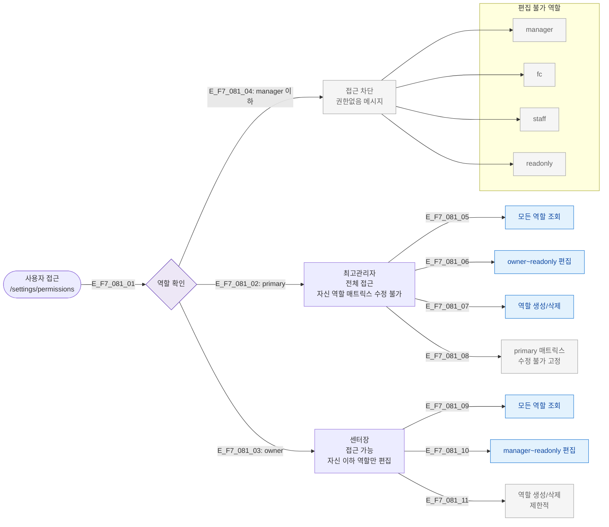

## 목적
SCR-081 접근 및 역할별 편집 가능 범위를 정의한다. primary만 모든 역할 권한 편집 가능.

## 다이어그램

## 역할별 접근 매트릭스
| 역할 | 접근 | 조회 | 역할 편집 | 역할 생성/삭제 |
|------|:---:|:---:|:--------:|:------------:|
| primary | ✅ | ✅ | owner~readonly | ✅ |
| owner | ✅ | ✅ | manager~readonly | 제한 |
| manager | ❌ | ❌ | ❌ | ❌ |
| fc | ❌ | ❌ | ❌ | ❌ |
| staff | ❌ | ❌ | ❌ | ❌ |
| readonly | ❌ | ❌ | ❌ | ❌ |

## TC 후보
- TC-081-002: 최고관리자(primary) 선택 시 매트릭스 수정 불가
- TC-081-012: 시스템 역할 삭제 옵션 미표시
