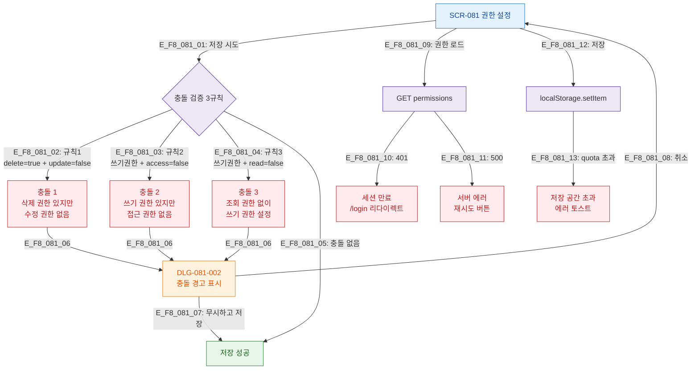

## 목적
SCR-081에서 발생하는 에러, 충돌 검증 실패, 복구 경로를 정의한다.

## 다이어그램

## TC 후보
- TC-081-006: 삭제=true + 수정=false → DLG-081-002 충돌 경고
- TC-081-NEG-001: 쓰기권한 + access=false → 충돌 경고
- TC-081-NEG-002: 쓰기권한 + read=false → 충돌 경고
