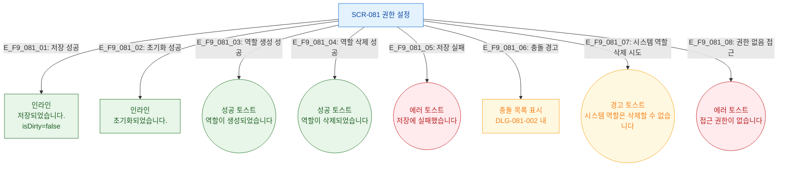

## 목적
SCR-081에서 발생하는 모든 피드백(토스트/인라인) 조건을 정의한다.

## 다이어그램

## TC 후보
- TC-081-007: 충돌 무시하고 저장 → "저장되었습니다." 표시
- TC-081-009: 역할 생성 → 성공 토스트
- TC-081-011: 역할 삭제 → 성공 토스트
- TC-081-012: 시스템 역할 삭제 시도 → 경고 토스트
