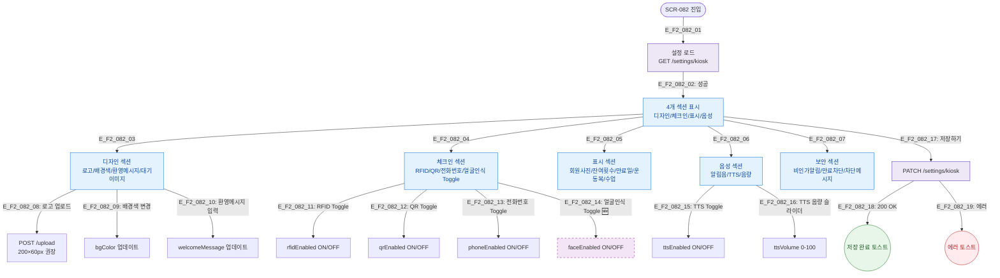

## 목적
키오스크 설정의 4개 섹션(디자인/체크인/표시/음성) 정상 시나리오를 정의한다.

## 다이어그램

## TC 후보
- TC-082-002: RFID Toggle OFF → rfidEnabled=false → 저장
- TC-082-003: 환영메시지 변경 → welcomeMessage 업데이트 → 저장
- TC-082-004: TTS 음량 슬라이더 50 → ttsVolume=50
