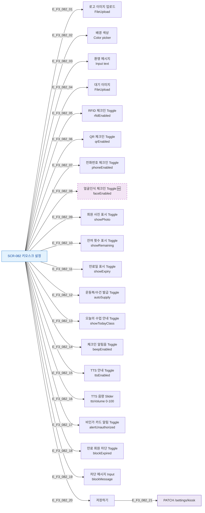

## 다이어그램

```mermaid
flowchart LR
    SCR082[SCR-082 키오스크 설정]

    SCR082 -->|E_F3_082_01| BTN_LOGO[로고 이미지 업로드\nFileUpload]
    SCR082 -->|E_F3_082_02| BTN_BG[배경 색상\nColor picker]
    SCR082 -->|E_F3_082_03| BTN_WELCOME[환영 메시지\nInput text]
    SCR082 -->|E_F3_082_04| BTN_IDLE[대기 이미지\nFileUpload]

    SCR082 -->|E_F3_082_05| TGL_RFID[RFID 체크인 Toggle\nrfidEnabled]
    SCR082 -->|E_F3_082_06| TGL_QR[QR 체크인 Toggle\nqrEnabled]
    SCR082 -->|E_F3_082_07| TGL_PHONE[전화번호 체크인 Toggle\nphoneEnabled]
    SCR082 -->|E_F3_082_08| TGL_FACE[얼굴인식 체크인 Toggle 🆕\nfaceEnabled]

    SCR082 -->|E_F3_082_09| TGL_PHOTO[회원 사진 표시 Toggle\nshowPhoto]
    SCR082 -->|E_F3_082_10| TGL_REMAIN[잔여 횟수 표시 Toggle\nshowRemaining]
    SCR082 -->|E_F3_082_11| TGL_EXPIRY[만료일 표시 Toggle\nshowExpiry]
    SCR082 -->|E_F3_082_12| TGL_SUPPLY[운동복/수건 발급 Toggle\nautoSupply]
    SCR082 -->|E_F3_082_13| TGL_CLASS[오늘의 수업 안내 Toggle\nshowTodayClass]

    SCR082 -->|E_F3_082_14| TGL_BEEP[체크인 알림음 Toggle\nbeepEnabled]
    SCR082 -->|E_F3_082_15| TGL_TTS[TTS 안내 Toggle\nttsEnabled]
    SCR082 -->|E_F3_082_16| SLD_TTS[TTS 음량 Slider\nttsVolume 0-100]

    SCR082 -->|E_F3_082_17| TGL_ALERT[비인가 카드 알림 Toggle\nalertUnauthorized]
    SCR082 -->|E_F3_082_18| TGL_BLOCK[만료 회원 차단 Toggle\nblockExpired]
    SCR082 -->|E_F3_082_19| INP_BLOCKMSG[차단 메시지 Input\nblockMessage]

    SCR082 -->|E_F3_082_20| BTN_SAVE[저장하기]
    BTN_SAVE -->|E_F3_082_21| ACT_SAVE[PATCH /settings/kiosk]

    classDef screen fill:#E3F2FD,stroke:#1976D2,color:#0D47A1
    classDef newFeature fill:#F3E5F5,stroke:#9C27B0,stroke-dasharray:5 5
    classDef system fill:#EDE7F6,stroke:#5E35B2
    class SCR082 screen
    class TGL_FACE newFeature
    class ACT_SAVE system
```

## TC 후보
- TC-082-002: RFID Toggle → rfidEnabled 변경
- TC-082-004: TTS 음량 슬라이더 조작
- TC-082-005: 차단 메시지 입력 → blockMessage 업데이트
