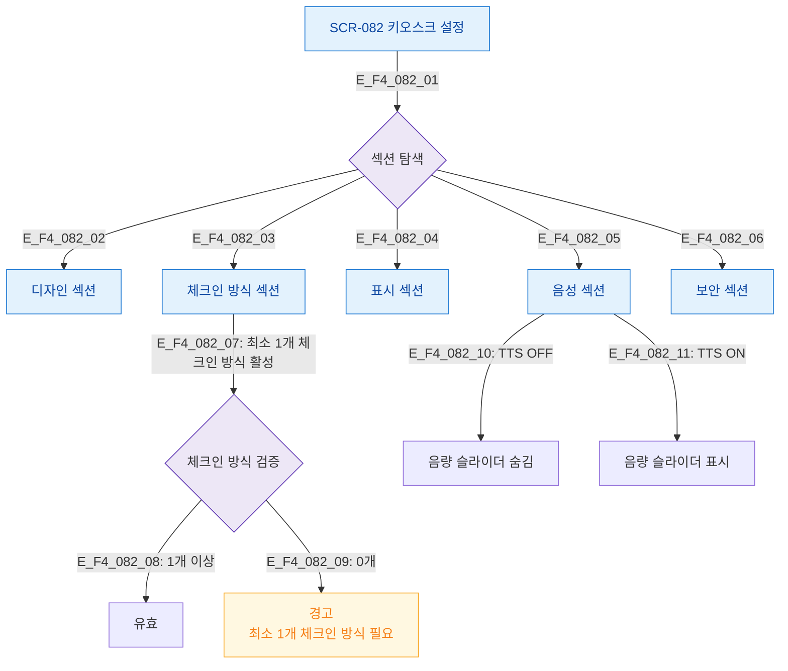

## 다이어그램

```mermaid
flowchart TD
    SCR082[SCR-082 키오스크 설정]

    SCR082 -->|E_F4_082_01| SecNav{섹션 탐색}
    SecNav -->|E_F4_082_02| S_Design[디자인 섹션]
    SecNav -->|E_F4_082_03| S_Checkin[체크인 방식 섹션]
    SecNav -->|E_F4_082_04| S_Display[표시 섹션]
    SecNav -->|E_F4_082_05| S_Audio[음성 섹션]
    SecNav -->|E_F4_082_06| S_Security[보안 섹션]

    S_Checkin -->|"E_F4_082_07: 최소 1개 체크인 방식 활성"| CheckinValidate{체크인 방식 검증}
    CheckinValidate -->|"E_F4_082_08: 1개 이상"| Valid[유효]
    CheckinValidate -->|"E_F4_082_09: 0개"| Invalid[경고\n최소 1개 체크인 방식 필요]

    S_Audio -->|"E_F4_082_10: TTS OFF"| HideVol[음량 슬라이더 숨김]
    S_Audio -->|"E_F4_082_11: TTS ON"| ShowVol[음량 슬라이더 표시]

    classDef screen fill:#E3F2FD,stroke:#1976D2,color:#0D47A1
    classDef warning fill:#FFF8E1,stroke:#F9A825,color:#F57F17
    classDef system fill:#EDE7F6,stroke:#5E35B2
    class SCR082,S_Design,S_Checkin,S_Display,S_Audio,S_Security screen
    class Invalid warning
    class SecNav,CheckinValidate system
```

## TC 후보
- TC-082-NEG-001: 모든 체크인 방식 OFF → 저장 시 경고
