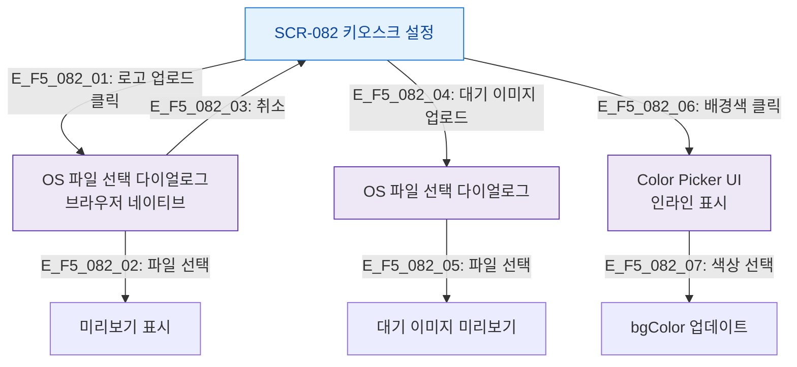

## 목적
SCR-082의 모달 트리거 경로. 키오스크 설정은 전용 모달 없이 인라인 편집 방식.

## 다이어그램

```mermaid
flowchart TD
    SCR082[SCR-082 키오스크 설정]

    SCR082 -->|"E_F5_082_01: 로고 업로드 클릭"| FileDialog[OS 파일 선택 다이얼로그\n브라우저 네이티브]
    FileDialog -->|"E_F5_082_02: 파일 선택"| UploadPreview[미리보기 표시]
    FileDialog -->|"E_F5_082_03: 취소"| SCR082

    SCR082 -->|"E_F5_082_04: 대기 이미지 업로드"| FileDialog2[OS 파일 선택 다이얼로그]
    FileDialog2 -->|"E_F5_082_05: 파일 선택"| IdlePreview[대기 이미지 미리보기]

    SCR082 -->|"E_F5_082_06: 배경색 클릭"| ColorPicker[Color Picker UI\n인라인 표시]
    ColorPicker -->|"E_F5_082_07: 색상 선택"| BgUpdate[bgColor 업데이트]

    classDef screen fill:#E3F2FD,stroke:#1976D2,color:#0D47A1
    classDef system fill:#EDE7F6,stroke:#5E35B2
    class SCR082 screen
    class FileDialog,FileDialog2,ColorPicker system
```

## TC 후보
- TC-082-006: 로고 업로드 → 파일 선택 → 미리보기 표시
- TC-082-007: 배경색 클릭 → Color Picker 표시 → 색상 선택
