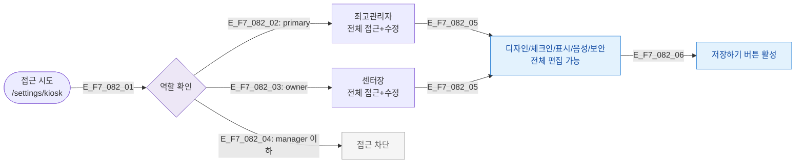

## 다이어그램

```mermaid
flowchart LR
    User([접근 시도\n/settings/kiosk])
    User -->|E_F7_082_01| RoleCheck{역할 확인}

    RoleCheck -->|E_F7_082_02: primary| P[최고관리자\n전체 접근+수정]
    RoleCheck -->|E_F7_082_03: owner| O[센터장\n전체 접근+수정]
    RoleCheck -->|E_F7_082_04: manager 이하| Blocked[접근 차단]

    P & O -->|E_F7_082_05| AllSections[디자인/체크인/표시/음성/보안\n전체 편집 가능]
    AllSections -->|E_F7_082_06| SaveBtn[저장하기 버튼 활성]

    classDef screen fill:#E3F2FD,stroke:#1976D2,color:#0D47A1
    classDef rbacBlocked fill:#F5F5F5,stroke:#9E9E9E,color:#616161
    classDef system fill:#EDE7F6,stroke:#5E35B2
    class AllSections,SaveBtn screen
    class Blocked rbacBlocked
    class RoleCheck system
```

## TC 후보
- TC-082-NEG-001: manager → /settings/kiosk → 접근 차단
