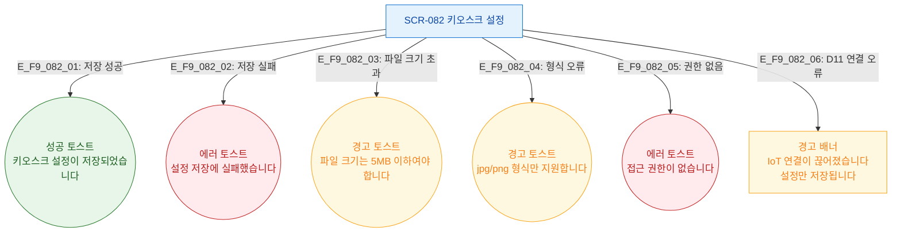

## 다이어그램

```mermaid
flowchart TD
    SCR082[SCR-082 키오스크 설정]

    SCR082 -->|"E_F9_082_01: 저장 성공"| FB_OK((성공 토스트\n키오스크 설정이 저장되었습니다))
    SCR082 -->|"E_F9_082_02: 저장 실패"| FB_Err((에러 토스트\n설정 저장에 실패했습니다))
    SCR082 -->|"E_F9_082_03: 파일 크기 초과"| FB_Size((경고 토스트\n파일 크기는 5MB 이하여야 합니다))
    SCR082 -->|"E_F9_082_04: 형식 오류"| FB_Type((경고 토스트\njpg/png 형식만 지원합니다))
    SCR082 -->|"E_F9_082_05: 권한 없음"| FB_Auth((에러 토스트\n접근 권한이 없습니다))
    SCR082 -->|"E_F9_082_06: D11 연결 오류"| FB_IoT[경고 배너\nIoT 연결이 끊어졌습니다\n설정만 저장됩니다]

    classDef screen fill:#E3F2FD,stroke:#1976D2,color:#0D47A1
    classDef success fill:#E8F5E9,stroke:#2E7D32,color:#1B5E20
    classDef error fill:#FFEBEE,stroke:#C62828,color:#B71C1C
    classDef warning fill:#FFF8E1,stroke:#F9A825,color:#F57F17
    class SCR082 screen
    class FB_OK success
    class FB_Err,FB_Auth error
    class FB_Size,FB_Type,FB_IoT warning
```

## TC 후보
- TC-082-002: 저장 성공 → 성공 토스트
- TC-082-NEG-002: 파일 5MB 초과 → 경고 토스트
