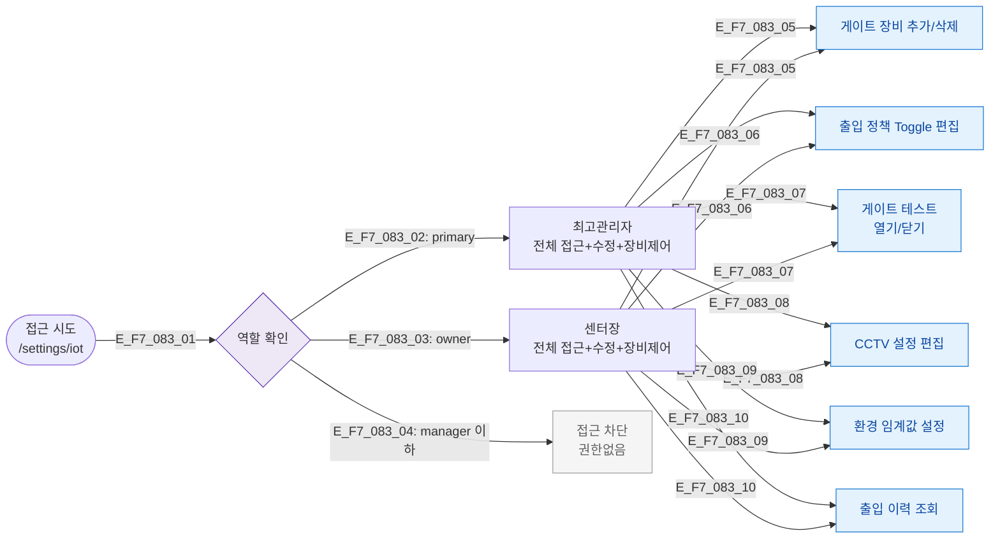

## 다이어그램

```mermaid
flowchart LR
    User([접근 시도\n/settings/iot])
    User -->|E_F7_083_01| RoleCheck{역할 확인}

    RoleCheck -->|E_F7_083_02: primary| P[최고관리자\n전체 접근+수정+장비제어]
    RoleCheck -->|E_F7_083_03: owner| O[센터장\n전체 접근+수정+장비제어]
    RoleCheck -->|E_F7_083_04: manager 이하| Blocked[접근 차단\n권한없음]

    P & O -->|E_F7_083_05| GateMgmt[게이트 장비 추가/삭제]
    P & O -->|E_F7_083_06| PolicyEdit[출입 정책 Toggle 편집]
    P & O -->|E_F7_083_07| GateTest[게이트 테스트\n열기/닫기]
    P & O -->|E_F7_083_08| CCTVMgmt[CCTV 설정 편집]
    P & O -->|E_F7_083_09| EnvThreshold[환경 임계값 설정]
    P & O -->|E_F7_083_10| LogView[출입 이력 조회]

    classDef screen fill:#E3F2FD,stroke:#1976D2,color:#0D47A1
    classDef rbacBlocked fill:#F5F5F5,stroke:#9E9E9E,color:#616161
    classDef system fill:#EDE7F6,stroke:#5E35B2
    class GateMgmt,PolicyEdit,GateTest,CCTVMgmt,EnvThreshold,LogView screen
    class Blocked rbacBlocked
    class RoleCheck system
```

## TC 후보
- TC-083-NEG-001: manager → /settings/iot → 접근 차단
