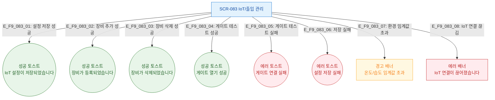

## 다이어그램

```mermaid
flowchart TD
    SCR083[SCR-083 IoT/출입 관리]

    SCR083 -->|E_F9_083_01: 설정 저장 성공| FB_SaveOK((성공 토스트\nIoT 설정이 저장되었습니다))
    SCR083 -->|E_F9_083_02: 장비 추가 성공| FB_AddOK((성공 토스트\n장비가 등록되었습니다))
    SCR083 -->|E_F9_083_03: 장비 삭제 성공| FB_DelOK((성공 토스트\n장비가 삭제되었습니다))
    SCR083 -->|E_F9_083_04: 게이트 테스트 성공| FB_GateOK((성공 토스트\n게이트 열기 성공))
    SCR083 -->|E_F9_083_05: 게이트 테스트 실패| FB_GateErr((에러 토스트\n게이트 연결 실패))
    SCR083 -->|E_F9_083_06: 저장 실패| FB_SaveErr((에러 토스트\n설정 저장 실패))
    SCR083 -->|E_F9_083_07: 환경 임계값 초과| FB_EnvWarn[경고 배너\n온도/습도 임계값 초과]
    SCR083 -->|E_F9_083_08: IoT 연결 끊김| FB_IoTErr[에러 배너\nIoT 연결이 끊어졌습니다]

    classDef screen fill:#E3F2FD,stroke:#1976D2,color:#0D47A1
    classDef success fill:#E8F5E9,stroke:#2E7D32,color:#1B5E20
    classDef error fill:#FFEBEE,stroke:#C62828,color:#B71C1C
    classDef warning fill:#FFF8E1,stroke:#F9A825,color:#F57F17
    class SCR083 screen
    class FB_SaveOK,FB_AddOK,FB_DelOK,FB_GateOK success
    class FB_GateErr,FB_SaveErr,FB_IoTErr error
    class FB_EnvWarn warning
```

## TC 후보
- TC-083-002: 장비 등록 성공 → 성공 토스트
- TC-083-003: 게이트 테스트 성공 → 성공 토스트
