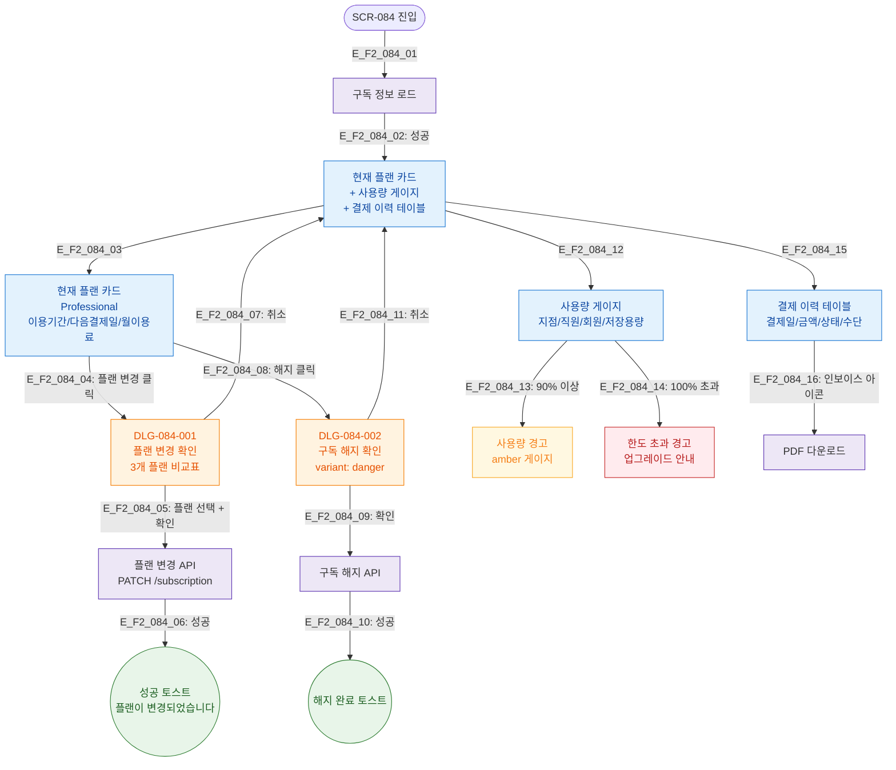

## 다이어그램

## TC 후보
- TC-084-001: /subscription → 플랜/기간/다음결제일/이용료 표시
- TC-084-002: 사용량 게이지 지점/직원/회원/용량 바 표시
- TC-084-003: 플랜 변경 → DLG-084-001 → 비교표 + 변경 확인
- TC-084-004: 결제 이력 테이블 표시
- TC-084-005: 인보이스 아이콘 → PDF 다운로드
