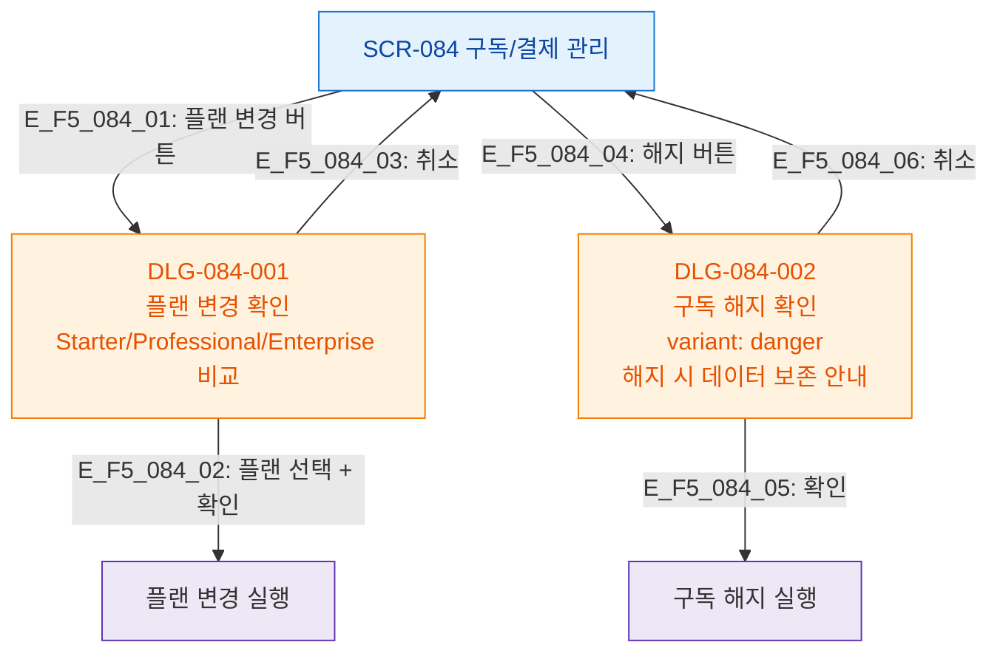

## 다이어그램

```mermaid
flowchart TD
    SCR084[SCR-084 구독/결제 관리]

    SCR084 -->|"E_F5_084_01: 플랜 변경 버튼"| DLG_001[DLG-084-001\n플랜 변경 확인\nStarter/Professional/Enterprise 비교]
    DLG_001 -->|"E_F5_084_02: 플랜 선택 + 확인"| ACT_CHANGE[플랜 변경 실행]
    DLG_001 -->|"E_F5_084_03: 취소"| SCR084

    SCR084 -->|"E_F5_084_04: 해지 버튼"| DLG_002[DLG-084-002\n구독 해지 확인\nvariant: danger\n해지 시 데이터 보존 안내]
    DLG_002 -->|"E_F5_084_05: 확인"| ACT_CANCEL[구독 해지 실행]
    DLG_002 -->|"E_F5_084_06: 취소"| SCR084

    classDef screen fill:#E3F2FD,stroke:#1976D2,color:#0D47A1
    classDef modal fill:#FFF3E0,stroke:#F57C00,color:#E65100
    classDef system fill:#EDE7F6,stroke:#5E35B2
    class SCR084 screen
    class DLG_001,DLG_002 modal
    class ACT_CHANGE,ACT_CANCEL system
```

## TC 후보
- TC-084-003: 플랜 변경 → DLG-084-001 → 3개 플랜 비교표 표시
