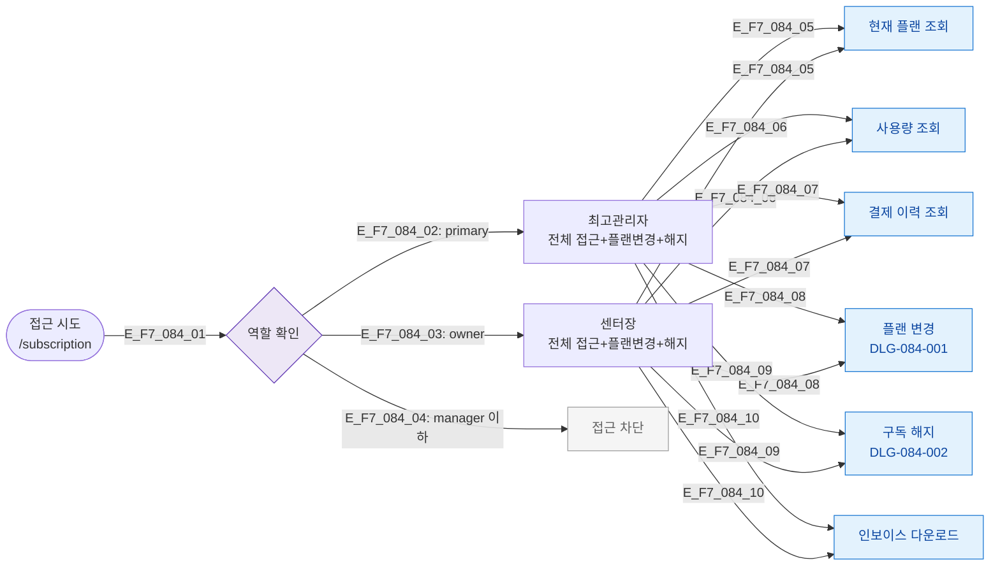

## 다이어그램

```mermaid
flowchart LR
    User([접근 시도\n/subscription])
    User -->|E_F7_084_01| RoleCheck{역할 확인}

    RoleCheck -->|"E_F7_084_02: primary"| P[최고관리자\n전체 접근+플랜변경+해지]
    RoleCheck -->|"E_F7_084_03: owner"| O[센터장\n전체 접근+플랜변경+해지]
    RoleCheck -->|"E_F7_084_04: manager 이하"| Blocked[접근 차단]

    P & O -->|E_F7_084_05| ViewPlan[현재 플랜 조회]
    P & O -->|E_F7_084_06| ViewUsage[사용량 조회]
    P & O -->|E_F7_084_07| ViewHistory[결제 이력 조회]
    P & O -->|E_F7_084_08| ChangePlan[플랜 변경\nDLG-084-001]
    P & O -->|E_F7_084_09| CancelSub[구독 해지\nDLG-084-002]
    P & O -->|E_F7_084_10| DownloadInvoice[인보이스 다운로드]

    classDef screen fill:#E3F2FD,stroke:#1976D2,color:#0D47A1
    classDef rbacBlocked fill:#F5F5F5,stroke:#9E9E9E,color:#616161
    classDef system fill:#EDE7F6,stroke:#5E35B2
    class ViewPlan,ViewUsage,ViewHistory,ChangePlan,CancelSub,DownloadInvoice screen
    class Blocked rbacBlocked
    class RoleCheck system
```

## TC 후보
- TC-084-NEG-001: manager → /subscription → 접근 차단
