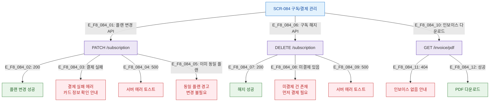

## 다이어그램

```mermaid
flowchart TD
    SCR084[SCR-084 구독/결제 관리]

    SCR084 -->|"E_F8_084_01: 플랜 변경 API"| ChangeReq[PATCH /subscription]
    ChangeReq -->|"E_F8_084_02: 200"| ChangeOK[플랜 변경 성공]
    ChangeReq -->|"E_F8_084_03: 결제 실패"| E_PayFail[결제 실패 에러\n카드 정보 확인 안내]
    ChangeReq -->|"E_F8_084_04: 500"| E_Server[서버 에러 토스트]
    ChangeReq -->|"E_F8_084_05: 이미 동일 플랜"| E_SamePlan[동일 플랜 경고\n변경 불필요]

    SCR084 -->|"E_F8_084_06: 구독 해지 API"| CancelReq[DELETE /subscription]
    CancelReq -->|"E_F8_084_07: 200"| CancelOK[해지 성공]
    CancelReq -->|"E_F8_084_08: 미결제 있음"| E_Unpaid[미결제 건 존재\n먼저 결제 필요]
    CancelReq -->|"E_F8_084_09: 500"| E_Server2[서버 에러 토스트]

    SCR084 -->|"E_F8_084_10: 인보이스 다운로드"| PDFReq[GET /invoice/pdf]
    PDFReq -->|"E_F8_084_11: 404"| E_NoInvoice[인보이스 없음 안내]
    PDFReq -->|"E_F8_084_12: 성공"| PDFDown[PDF 다운로드]

    classDef screen fill:#E3F2FD,stroke:#1976D2,color:#0D47A1
    classDef error fill:#FFEBEE,stroke:#C62828,color:#B71C1C
    classDef success fill:#E8F5E9,stroke:#2E7D32,color:#1B5E20
    classDef system fill:#EDE7F6,stroke:#5E35B2
    class SCR084 screen
    class E_PayFail,E_Server,E_SamePlan,E_Unpaid,E_Server2,E_NoInvoice error
    class ChangeOK,CancelOK,PDFDown success
    class ChangeReq,CancelReq,PDFReq system
```

## TC 후보
- TC-084-NEG-002: 플랜 변경 결제 실패 → 카드 정보 확인 안내
