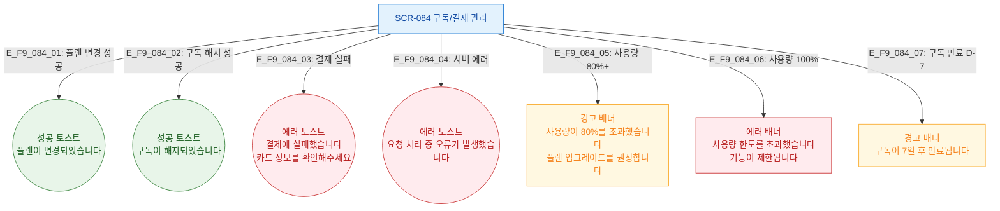

## 다이어그램

```mermaid
flowchart TD
    SCR084[SCR-084 구독/결제 관리]

    SCR084 -->|E_F9_084_01: 플랜 변경 성공| FB_PlanOK((성공 토스트\n플랜이 변경되었습니다))
    SCR084 -->|E_F9_084_02: 구독 해지 성공| FB_CancelOK((성공 토스트\n구독이 해지되었습니다))
    SCR084 -->|E_F9_084_03: 결제 실패| FB_PayErr((에러 토스트\n결제에 실패했습니다\n카드 정보를 확인해주세요))
    SCR084 -->|E_F9_084_04: 서버 에러| FB_ServerErr((에러 토스트\n요청 처리 중 오류가 발생했습니다))
    SCR084 -->|E_F9_084_05: 사용량 80%+| FB_UsageWarn[경고 배너\n사용량이 80%를 초과했습니다\n플랜 업그레이드를 권장합니다]
    SCR084 -->|E_F9_084_06: 사용량 100%| FB_UsageMax[에러 배너\n사용량 한도를 초과했습니다\n기능이 제한됩니다]
    SCR084 -->|E_F9_084_07: 구독 만료 D-7| FB_ExpireWarn[경고 배너\n구독이 7일 후 만료됩니다]

    classDef screen fill:#E3F2FD,stroke:#1976D2,color:#0D47A1
    classDef success fill:#E8F5E9,stroke:#2E7D32,color:#1B5E20
    classDef error fill:#FFEBEE,stroke:#C62828,color:#B71C1C
    classDef warning fill:#FFF8E1,stroke:#F9A825,color:#F57F17
    class SCR084 screen
    class FB_PlanOK,FB_CancelOK success
    class FB_PayErr,FB_ServerErr,FB_UsageMax error
    class FB_UsageWarn,FB_ExpireWarn warning
```

## TC 후보
- TC-084-003: 플랜 변경 성공 → 성공 토스트
