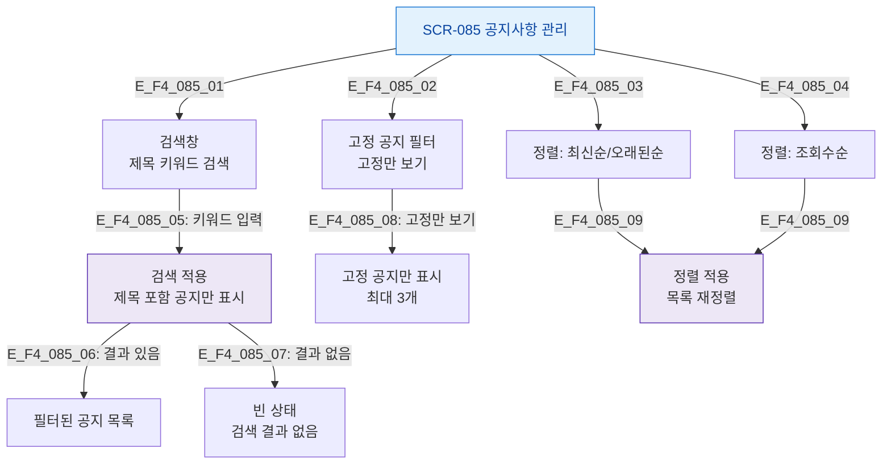

## 다이어그램

```mermaid
flowchart TD
    SCR085[SCR-085 공지사항 관리]

    SCR085 -->|E_F4_085_01| SearchBar[검색창\n제목 키워드 검색]
    SCR085 -->|E_F4_085_02| PinFilter[고정 공지 필터\n고정만 보기]
    SCR085 -->|E_F4_085_03| SortDate[정렬: 최신순/오래된순]
    SCR085 -->|E_F4_085_04| SortView[정렬: 조회수순]

    SearchBar -->|E_F4_085_05: 키워드 입력| SearchApply[검색 적용\n제목 포함 공지만 표시]
    SearchApply -->|E_F4_085_06: 결과 있음| ResultList[필터된 공지 목록]
    SearchApply -->|E_F4_085_07: 결과 없음| EmptySearch[빈 상태\n검색 결과 없음]

    PinFilter -->|E_F4_085_08: 고정만 보기| PinnedList[고정 공지만 표시\n최대 3개]

    SortDate & SortView -->|E_F4_085_09| SortApply[정렬 적용\n목록 재정렬]

    classDef screen fill:#E3F2FD,stroke:#1976D2,color:#0D47A1
    classDef system fill:#EDE7F6,stroke:#5E35B2
    class SCR085 screen
    class SearchApply,SortApply system
```

## TC 후보
- TC-085-004: 키워드 검색 → 포함 공지만 표시
- TC-085-005: 고정 공지 필터 → 고정만 표시
